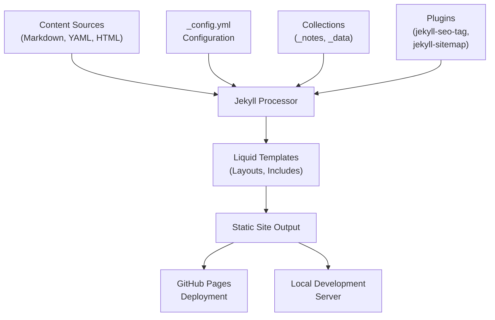
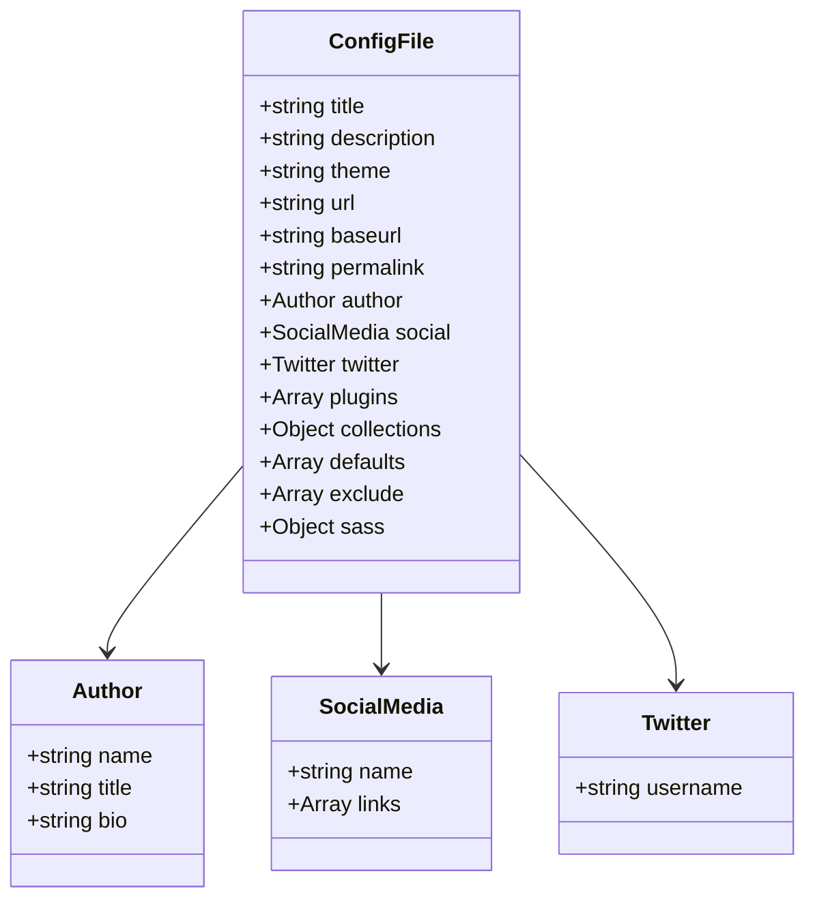
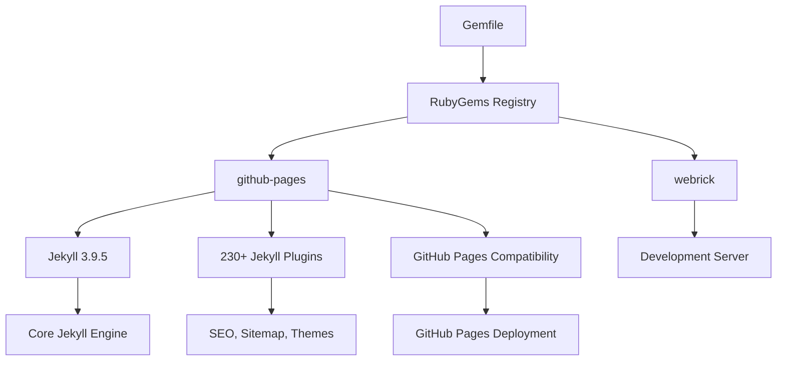
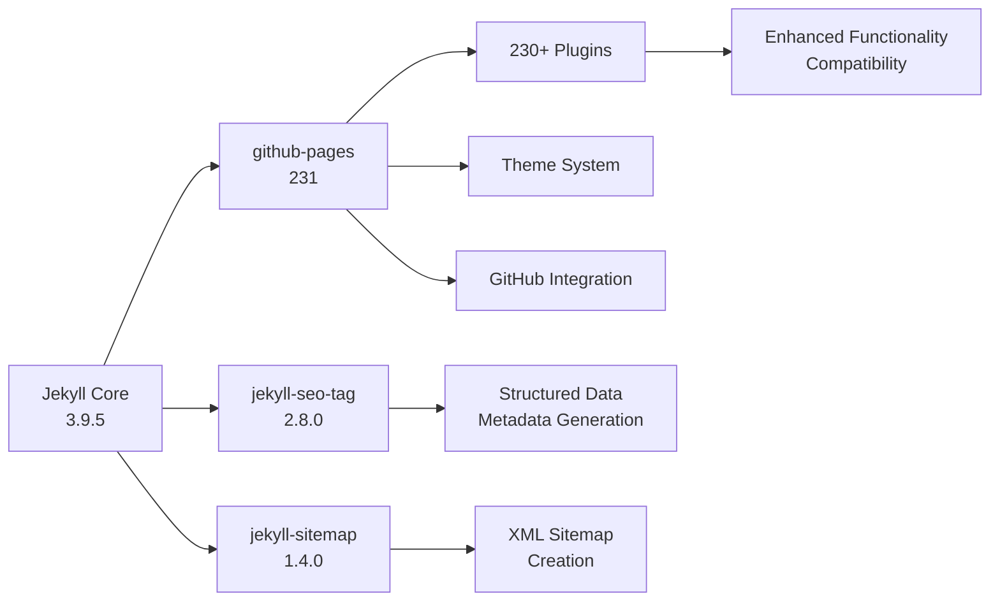
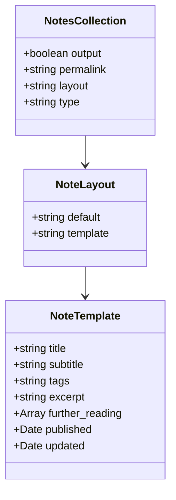
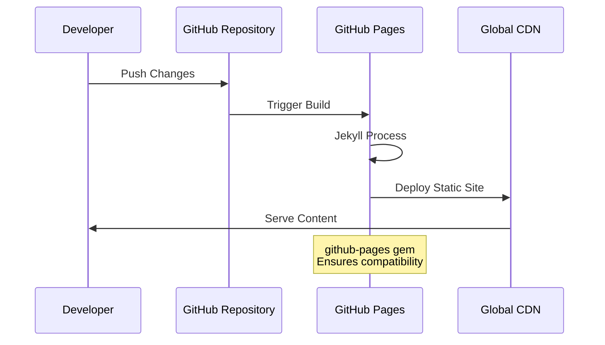
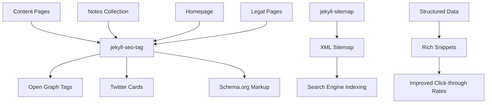
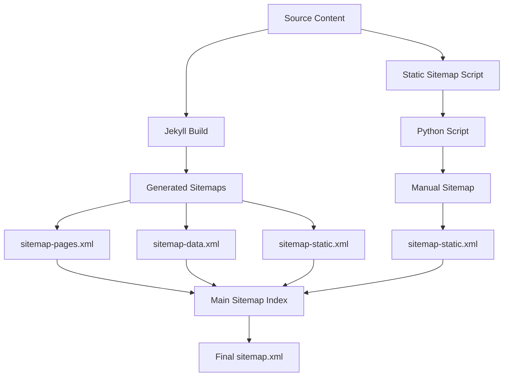

# Technology Stack & Dependencies

<cite>
**Referenced Files in This Document**
- [_config.yml](file://_config.yml)
- [Gemfile](file://Gemfile)
- [Gemfile.lock](file://Gemfile.lock)
- [README.md](file://README.md)
- [_notes/ai_ml.md](file://_notes/ai_ml.md)
- [_layouts/note.html](file://_layouts/note.html)
- [_includes/head.html](file://_includes/head.html)
- [_includes/seo/structured-data.html](file://_includes/seo/structured-data.html)
- [bin/build_static_sitemap.py](file://bin/build_static_sitemap.py)
- [sitemap.xml](file://sitemap.xml)
</cite>

## Table of Contents
1. [Introduction](#introduction)
2. [Jekyll Static Site Generator](#jekyll-static-site-generator)
3. [Configuration Management](#configuration-management)
4. [Dependency Management with Bundler](#dependency-management-with-bundler)
5. [Critical Gems and Plugins](#critical-gems-and-plugins)
6. [Collection Definitions](#collection-definitions)
7. [GitHub Pages Integration](#github-pages-integration)
8. [SEO and Metadata Generation](#seo-and-metadata-generation)
9. [Build Process and Optimization](#build-process-and-optimization)
10. [Troubleshooting and Common Issues](#troubleshooting-and-common-issues)
11. [Performance Considerations](#performance-considerations)
12. [Conclusion](#conclusion)

## Introduction

This personal brand website for Dzmitryi Kharlanau is built on a robust Jekyll-based technology stack that combines static site generation with modern web development practices. The architecture leverages Jekyll as a powerful static site generator while incorporating sophisticated dependency management through Bundler, comprehensive SEO capabilities, and automated sitemap generation for optimal search engine visibility.

The technology stack emphasizes simplicity, performance, and maintainability through a carefully curated selection of Ruby gems and plugins that enable seamless GitHub Pages deployment while providing advanced features like structured data markup, XML sitemap creation, and AI-friendly content delivery.

## Jekyll Static Site Generator

Jekyll serves as the core static site generator for this personal brand website, transforming Markdown content and Liquid templates into a fully functional static website. The framework operates on a simple principle: convert content written in Markdown with embedded Liquid templating into HTML files that can be served statically.

### Core Architecture

**Diagram sources**
- [_config.yml](file://_config.yml#L1-L51)
- [Gemfile](file://Gemfile#L1-L5)

### Key Features

The Jekyll implementation utilizes several fundamental features that contribute to the site's functionality:

- **Front Matter Processing**: Each Markdown file begins with YAML front matter that defines metadata, layouts, and processing instructions
- **Liquid Templating**: Dynamic content generation through the Liquid templating engine
- **Asset Processing**: Automatic compilation of Sass/CSS and JavaScript assets
- **Plugin Architecture**: Extensible functionality through community-developed plugins
- **Incremental Regeneration**: Efficient development workflow with automatic rebuilds

**Section sources**
- [_config.yml](file://_config.yml#L1-L51)
- [Gemfile](file://Gemfile#L1-L5)

## Configuration Management

The Jekyll configuration is centralized in the `_config.yml` file, which serves as the single source of truth for all site settings, collections, and processing directives.

### Configuration Structure

**Diagram sources**
- [_config.yml](file://_config.yml#L1-L51)

### Essential Configuration Options

The configuration defines several critical aspects of the site's behavior:

**Site Metadata**: Comprehensive metadata including title, description, author information, and social media links
**Theme Selection**: Uses the Minima theme as the foundation for consistent styling
**URL Configuration**: Proper base URL and permalink structure for GitHub Pages deployment
**Plugin Loading**: Explicit declaration of required plugins for SEO and sitemap functionality
**Collection Definitions**: Structured definition of the notes collection with custom permalink patterns
**Default Values**: Layout assignments for different content types
**Exclusion Rules**: Files and directories excluded from the build process

**Section sources**
- [_config.yml](file://_config.yml#L1-L51)

## Dependency Management with Bundler

The project employs Bundler for precise dependency management, ensuring consistent environments across development, testing, and production deployments.

### Gemfile Structure

**Diagram sources**
- [Gemfile](file://Gemfile#L1-L5)
- [Gemfile.lock](file://Gemfile.lock#L1-L266)

### Dependency Analysis

The Gemfile specifies two primary dependencies:

**github-pages**: The main dependency that includes Jekyll 3.9.5 along with 230+ associated plugins, themes, and dependencies specifically configured for GitHub Pages compatibility. This ensures that the site will build correctly on GitHub's infrastructure.

**webrick**: A development server dependency pinned to version 1.8, providing the local development server functionality for previewing changes during development.

### Version Management

The Gemfile.lock maintains exact versions for all dependencies, ensuring reproducible builds across different environments. This lock file contains 266 lines of dependency specifications, covering everything from core Ruby gems to specialized Jekyll plugins.

**Section sources**
- [Gemfile](file://Gemfile#L1-L5)
- [Gemfile.lock](file://Gemfile.lock#L1-L266)

## Critical Gems and Plugins

The technology stack relies on several critical gems and plugins that provide essential functionality for the site's operation and SEO optimization.

### Core Plugin Ecosystem

**Diagram sources**
- [Gemfile.lock](file://Gemfile.lock#L25-L89)
- [_config.yml](file://_config.yml#L20-L22)

### Plugin Functionality

**jekyll-seo-tag (2.8.0)**: Automatically generates SEO metadata including Open Graph tags, Twitter Cards, and Schema.org structured data. This plugin processes each page's front matter and generates appropriate metadata for search engines and social media platforms.

**jekyll-sitemap (1.4.0)**: Creates XML sitemaps for improved search engine indexing. The plugin automatically discovers pages, posts, and collections to include in the sitemap structure.

**github-pages (231)**: A meta-gem that includes Jekyll 3.9.5 along with 230+ compatible plugins, themes, and dependencies specifically tested for GitHub Pages compatibility.

### GitHub Pages Compatibility

The github-pages gem ensures that the site will build correctly on GitHub's infrastructure by including only compatible plugins and versions. This prevents deployment failures that could occur with incompatible gem combinations.

**Section sources**
- [Gemfile.lock](file://Gemfile.lock#L25-L89)
- [_config.yml](file://_config.yml#L20-L22)

## Collection Definitions

The site utilizes Jekyll collections to organize and manage different types of content, particularly the notes collection for long-form articles.

### Notes Collection Configuration

**Diagram sources**
- [_config.yml](file://_config.yml#L23-L28)
- [_layouts/note.html](file://_layouts/note.html#L1-L57)

### Collection Implementation

The notes collection is defined with specific configuration parameters:

**Output Control**: Enabled with `output: true` to generate individual HTML files for each note
**Custom Permalink**: Uses `/notes/:slug/` pattern for clean URL structure
**Layout Assignment**: Automatically applies the `note` layout to all collection items
**Scope Definition**: Applies default values to all notes in the collection

### Content Structure

Each note in the collection follows a standardized front matter structure with fields for title, description, tags, publication dates, and further reading links. The layout template processes this metadata to create rich article pages with proper navigation and metadata.

**Section sources**
- [_config.yml](file://_config.yml#L23-L28)
- [_notes/ai_ml.md](file://_notes/ai_ml.md#L1-L123)
- [_layouts/note.html](file://_layouts/note.html#L1-L57)

## GitHub Pages Integration

The site is designed for seamless deployment on GitHub Pages, leveraging the platform's Jekyll integration and providing a streamlined development-to-deployment workflow.

### Deployment Architecture

**Diagram sources**
- [Gemfile](file://Gemfile#L1-L5)
- [README.md](file://README.md#L1-L25)

### GitHub Pages Benefits

The integration provides several advantages:

**Automatic Builds**: GitHub Pages automatically triggers Jekyll builds on every push to the repository
**Free Hosting**: Static sites are served at no cost with unlimited bandwidth
**Global Distribution**: Content is distributed through GitHub's global CDN network
**SSL/TLS**: Automatic HTTPS enforcement for secure content delivery
**Custom Domains**: Support for custom domain configuration with DNS settings

### Deployment Configuration

The site uses the following GitHub Pages configuration:

**Repository Structure**: Follows GitHub Pages expected structure with proper directory organization
**Branch Deployment**: Typically deployed from the main branch or gh-pages branch
**Custom Domain**: Configured with `dkharlanau.github.io` domain
**Base URL**: No base URL specified for GitHub Pages deployment

**Section sources**
- [README.md](file://README.md#L1-L25)
- [_config.yml](file://_config.yml#L6-L7)

## SEO and Metadata Generation

The site implements comprehensive SEO capabilities through structured metadata generation and XML sitemap creation.

### SEO Architecture

**Diagram sources**
- [_includes/head.html](file://_includes/head.html#L1-L113)
- [_includes/seo/structured-data.html](file://_includes/seo/structured-data.html#L1-L77)

### Metadata Generation

The SEO implementation covers multiple aspects:

**Open Graph Tags**: Facebook and social media sharing optimization with proper image and description handling
**Twitter Cards**: Twitter-specific metadata for enhanced tweet previews
**Schema.org Structured Data**: Rich snippets for search engines including Person, WebSite, Article, and DataCatalog types
**Canonical URLs**: Proper canonical link handling to prevent duplicate content issues
**RSS Feeds**: Alternative feed formats for content syndication

### Structured Data Implementation

The site generates comprehensive structured data for various content types:

**Person Schema**: Author information with job title, organization, and social media profiles
**WebSite Schema**: Site-wide metadata including search functionality
**Article Schema**: Individual note metadata with publication dates, authors, and breadcrumb navigation
**DataCatalog Schema**: AI data catalog structure for machine-readable content

**Section sources**
- [_includes/head.html](file://_includes/head.html#L1-L113)
- [_includes/seo/structured-data.html](file://_includes/seo/structured-data.html#L1-L77)

## Build Process and Optimization

The site incorporates both automated and manual build processes to ensure efficient content delivery and search engine optimization.

### Multi-Stage Sitemap Generation

**Diagram sources**
- [bin/build_static_sitemap.py](file://bin/build_static_sitemap.py#L1-L190)
- [sitemap.xml](file://sitemap.xml#L1-L11)

### Automated Sitemap Generation

The site uses jekyll-sitemap plugin to automatically generate sitemaps for:

**Standard Pages**: Markdown and HTML pages with front matter
**Collection Items**: Notes collection with custom permalink handling
**Data Assets**: AI data files in the `/ai/` directory
**Static Assets**: Additional static files and resources

### Manual Sitemap Generation

A custom Python script provides additional sitemap generation capabilities:

**Comprehensive Coverage**: Includes all content types not covered by Jekyll plugins
**Custom Logic**: Handles edge cases and specific URL patterns
**Timestamp Generation**: Accurate modification timestamps for search engines
**URL Normalization**: Consistent URL formatting and path handling

### Build Optimization

The build process incorporates several optimization strategies:

**Incremental Processing**: Jekyll's incremental regeneration for faster development builds
**Asset Compression**: CSS compression through Sass configuration
**Selective Exclusions**: Carefully defined exclusion lists to reduce build time
**Plugin Efficiency**: Minimal plugin set to balance functionality with performance

**Section sources**
- [bin/build_static_sitemap.py](file://bin/build_static_sitemap.py#L1-L190)
- [sitemap.xml](file://sitemap.xml#L1-L11)
- [_config.yml](file://_config.yml#L29-L35)

## Troubleshooting and Common Issues

The Jekyll-based technology stack may encounter several common issues that require specific resolution approaches.

### Version Conflicts

**Problem**: Gem version conflicts between local development and GitHub Pages
**Solution**: Use the github-pages gem to ensure compatibility with GitHub's Jekyll version

**Problem**: Ruby version mismatches causing build failures
**Solution**: Verify Ruby version compatibility and update Gemfile.lock accordingly

### Gem Installation Errors

**Problem**: Native extension compilation failures
**Solution**: Install system dependencies for native gems, particularly nokogiri and sass

**Problem**: Permission issues during gem installation
**Solution**: Use Bundler with proper permissions or system-wide Ruby installation

### Build Failures

**Problem**: Template rendering errors in Liquid
**Solution**: Validate front matter syntax and template variable references

**Problem**: Asset compilation failures
**Solution**: Check Sass syntax and asset path configurations

### Deployment Issues

**Problem**: GitHub Pages build failures
**Solution**: Review GitHub Actions logs and ensure Gemfile compatibility

**Problem**: Custom domain configuration problems
**Solution**: Verify DNS settings and GitHub Pages custom domain configuration

### Performance Issues

**Problem**: Slow build times
**Solution**: Optimize asset processing and reduce unnecessary plugin usage

**Problem**: Large bundle size
**Solution**: Implement asset optimization and lazy loading strategies

## Performance Considerations

The technology stack is designed with performance optimization in mind, balancing functionality with fast content delivery.

### Local Development Performance

**Incremental Regeneration**: Jekyll's incremental build system reduces development cycle times
**Live Reload**: Automatic browser refresh on content changes
**Asset Optimization**: CSS compression and efficient asset processing

### Production Performance

**Static Delivery**: Pure static files eliminate server-side processing overhead
**CDN Distribution**: GitHub Pages CDN provides global content delivery
**Minimal Dependencies**: Streamlined plugin selection reduces build complexity

### Optimization Strategies

**Asset Minification**: CSS compression through Sass configuration
**Lazy Loading**: Strategic implementation of lazy loading for images and content
**Caching Headers**: Proper cache control headers for improved user experience
**Compression**: Automatic gzip compression for text assets

### Monitoring and Maintenance

**Build Performance**: Monitor build times and optimize as needed
**Content Freshness**: Regular sitemap updates and metadata verification
**Dependency Updates**: Periodic review of gem dependencies for security and performance improvements

## Conclusion

The Jekyll-based technology stack for this personal brand website demonstrates a mature approach to static site generation that balances simplicity with advanced functionality. Through careful selection of dependencies, comprehensive SEO implementation, and robust deployment automation, the stack provides an excellent foundation for content-driven websites.

The architecture successfully addresses key requirements including GitHub Pages compatibility, comprehensive SEO capabilities, AI-friendly content delivery, and maintainable development workflows. The combination of automated and manual sitemap generation ensures optimal search engine visibility while the structured data implementation enhances search result presentation.

The technology stack's emphasis on stability, performance, and maintainability makes it suitable for long-term content management while providing the flexibility needed for evolving content requirements. The careful dependency management through Bundler ensures consistent environments across development and production, while the plugin architecture allows for future enhancements without compromising existing functionality.