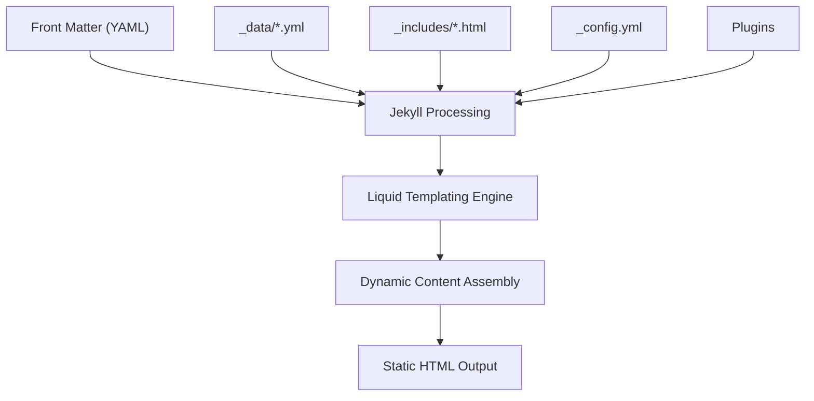

# Technology Stack

<cite>
**Referenced Files in This Document**   
- [_config.yml](file://_config.yml)
- [Gemfile](file://Gemfile)
- [README.md](file://README.md)
- [ARCHITECTURE.md](file://ARCHITECTURE.md)
- [assets/main.css](file://assets/main.css)
- [_layouts/default.html](file://_layouts/default.html)
- [_includes/page-builder.html](file://_includes/page-builder.html)
- [_includes/seo/structured-data.html](file://_includes/seo/structured-data.html)
- [_data/resume.yml](file://_data/resume.yml)
- [_data/home.yml](file://_data/home.yml)
- [_data/social.yml](file://_data/social.yml)
</cite>

## Table of Contents
1. [Jekyll as a Static Site Generator](#jekyll-as-a-static-site-generator)
2. [Configuration and Site Metadata](#configuration-and-site-metadata)
3. [GitHub Pages for CI/CD and Hosting](#github-pages-for-cicd-and-hosting)
4. [Dependencies and Plugins](#dependencies-and-plugins)
5. [Liquid Templating for Dynamic Content](#liquid-templating-for-dynamic-content)
6. [Local Development Setup](#local-development-setup)
7. [Troubleshooting Common Issues](#troubleshooting-common-issues)

## Jekyll as a Static Site Generator

Jekyll processes Markdown files, Liquid templates, and YAML data to generate static HTML pages. The site uses a component-based architecture where content is structured in `_data/` as YAML files, rendered through reusable HTML partials in `_includes/`, and composed into pages via layouts in `_layouts/`. Markdown files such as those in `_notes/` are transformed into static pages using the `note` layout, with permalinks defined in `_config.yml`. The `page-builder.html` include dynamically assembles homepage sections based on the `sections` front matter in `index.md`, enabling modular composition without duplicating logic.

**Section sources**
- [ARCHITECTURE.md](file://ARCHITECTURE.md#L1-L69)
- [index.md](file://index.md#L1-L15)
- [_includes/page-builder.html](file://_includes/page-builder.html#L1-L40)

## Configuration and Site Metadata

The `_config.yml` file defines core site metadata including `title`, `description`, `url`, and `author` information. Language is set to English (`lang: en`), and permalinks use the `pretty` format for clean URLs. The configuration declares a `notes` collection with output enabled and custom permalinks (`/notes/:slug/`), ensuring each note in `_notes/` generates a dedicated page. Default layout assignments apply the `note` layout to all notes. Excluded files and directories prevent unnecessary assets from being processed. The `sass` block compresses CSS output, while `include` ensures `LLM.txt` is published despite being outside typical content paths.

**Section sources**
- [_config.yml](file://_config.yml#L1-L50)

## GitHub Pages for CI/CD and Hosting

The project is configured for deployment via GitHub Pages using the `github-pages` gem, which bundles Jekyll and compatible plugins. The repository structure follows GitHub Pages conventions, with content served from the root directory. On push to the main branch, GitHub Actions automatically build the site using the Gemfile-specified dependencies and deploy the generated static assets. This enables zero-downtime updates and global CDN distribution without requiring manual intervention. The `baseurl` is empty, indicating the site is served from the root of the GitHub Pages domain.

**Section sources**
- [Gemfile](file://Gemfile#L1-L5)
- [README.md](file://README.md#L1-L24)

## Dependencies and Plugins

The site uses the `github-pages` gem to ensure compatibility with GitHub Pages' build environment. Additional dependencies include `webrick` (~> 1.8) to support Ruby 3+ environments. The `_config.yml` enables two key plugins: `jekyll-seo-tag` for generating meta tags, Open Graph, and Twitter Card data, and `jekyll-sitemap` for automatically creating `sitemap.xml`. These plugins enhance discoverability and indexing without requiring manual configuration. The `jekyll-seo-tag` leverages site and page metadata from `_config.yml` and front matter to inject structured SEO headers into the `<head>` of each page via the `` tag in `default.html`.

**Section sources**
- [Gemfile](file://Gemfile#L1-L5)
- [_config.yml](file://_config.yml#L1-L50)
- [_layouts/default.html](file://_layouts/default.html#L1-L47)

## Liquid Templating for Dynamic Content

Liquid templating enables dynamic content composition within the static site framework. Data from `_data/resume.yml`, `_data/home.yml`, and `_data/social.yml` is injected into templates using `site.data`. The `page-builder.html` include uses a `` statement to conditionally render section partials based on the `sections` array in front matter. Includes like `components/social-line.html` accept parameters such as `variant` and `links` for reusable, configurable components. Structured data in `seo/structured-data.html` uses Liquid to generate JSON-LD scripts for `Person`, `WebSite`, `Dataset`, `BreadcrumbList`, and `Article` types, enhancing SEO and AI readability. Variables and filters construct absolute URLs, escape special characters, and format dates for schema compliance.

**Diagram sources**
- [_includes/page-builder.html](file://_includes/page-builder.html#L1-L40)
- [_includes/seo/structured-data.html](file://_includes/seo/structured-data.html#L1-L190)
- [_data/resume.yml](file://_data/resume.yml#L1-L441)
- [_data/home.yml](file://_data/home.yml#L1-L56)

**Section sources**
- [_includes/page-builder.html](file://_includes/page-builder.html#L1-L40)
- [_includes/seo/structured-data.html](file://_includes/seo/structured-data.html#L1-L190)

## Local Development Setup

To set up the project locally, ensure Ruby 3.0+ and Bundler are installed. Run `bundle install` to install dependencies specified in the Gemfile, including Jekyll and the `github-pages` gem. Start the development server with `bundle exec jekyll serve`, which launches a local instance at `http://localhost:4000`. The site automatically rebuilds on file changes, enabling rapid iteration. The `webrick` gem resolves server compatibility issues in modern Ruby versions. Configuration in `_config.yml` ensures the local environment mirrors production behavior, including permalink structure and collection processing.

**Section sources**
- [Gemfile](file://Gemfile#L1-L5)
- [README.md](file://README.md#L1-L24)
- [_config.yml](file://_config.yml#L1-L50)

## Troubleshooting Common Issues

Common Jekyll build issues include plugin compatibility and gem version conflicts. Ensure the `github-pages` gem is used to maintain environment parity with GitHub Pages. Ruby version mismatches may require updating Bundler or specifying `webrick` explicitly, as done in the Gemfile. If Liquid errors occur, validate YAML syntax in `_data/` files and check for undefined variables in templates. Missing assets or 404s often stem from incorrect `baseurl` settings or excluded files; verify `exclude` and `include` lists in `_config.yml`. For SEO or structured data issues, confirm that `jekyll-seo-tag` is properly loaded and that required metadata (e.g., `author`, `title`) is present in front matter or configuration.

**Section sources**
- [Gemfile](file://Gemfile#L1-L5)
- [_config.yml](file://_config.yml#L1-L50)
- [_includes/seo/structured-data.html](file://_includes/seo/structured-data.html#L1-L190)